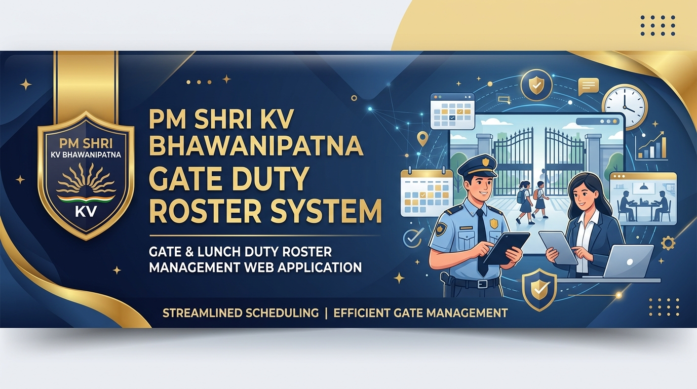

# 🏫 PM SHRI KV BHAWANIPATNA - Gate & Lunch Duty Roster System

> An intelligent, automated, CSP-powered web application designed for **PM SHRI Kendriya Vidyalaya Bhawanipatna** to manage, shuffle, and print Weekly Gate & Lunch Duty Rosters with strict administrative compliance rules.

---

## 🌟 Live Demo & Deployment

- ⚡ **Live Vercel Production Web App**: [https://pm-shri-kv-gate-duty-roster.vercel.app](https://pm-shri-kv-gate-duty-roster.vercel.app)
- 🐙 **Official GitHub Repository**: [https://github.com/sarki24/kv-gate-duty-app](https://github.com/sarki24/kv-gate-duty-app)

---

## ✨ Key Features & Capabilities

### 🔒 1. Intelligent CSP Shuffling Algorithm
- **Permanent / Regular Gate 2 Priority**: Entry Gate 2 and Exit Gate 2 duties are **ALWAYS & ONLY assigned to Permanent (Regular) teachers** across all 6 days (Mon–Sat).
- **Unanimous Duty Mixing**: Gate 1 and Lunch Duty posts (*Near Chemistry Lab*, *Near Class 6B*, *Assembly Ground*) are **unanimously mixed** between Regular and Contractual staff.
- **Fair Allocation Constraints**:
  - Maximum 1 duty per week for Regular teachers.
  - Maximum 2 duties per week for Contractual teachers.
  - Non-consecutive day safety gap rules to prevent duty fatigue.

### 📄 2. Clean A4 Landscape PDF Export
- Generates crisp, official 2-page PDF rosters (*Page 1: Gate Duty*, *Page 2: Lunch Duty*) via `html2pdf`.
- Clean header branding, date range display, custom instructions/note box, and signature blocks (*Time Table I/c*, *Discipline I/c*, *Principal*).
- Mathematically aligned cell borders with zero dark bars or text clipping.

### 👥 3. Staff Management & Bulk Import
- Pre-seeded with official 50-member staff list of PM SHRI KV Bhawanipatna.
- **Bulk Import Engine**: Upload or paste `.xlsx`, `.pdf`, `.docx`, `.csv`, `.txt`, or scanned images (OCR via Tesseract.js).
- **Find & Replace Tool**: Batch edit teacher names or titles in bulk.
- **Drag & Drop Reordering**: Easily adjust staff hierarchy with automatic S.No. re-numbering.

### 📱 4. Progressive Web App (PWA) & Mobile Access
- Full mobile responsiveness with QR code sharing.
- Works 100% offline as an installable PWA app or standalone single-file HTML (`gate-duty-app-standalone.html`).

---

## 🛠️ Technology Stack

- **Frontend**: Vanilla HTML5, Modern CSS3 (CSS Variables, Flexbox, CSS Grid), JavaScript (ES6+ Modules)
- **Algorithms**: Backtracking Constraint Satisfaction Problem (CSP) Engine
- **PDF Engine**: `html2pdf.js`, `html2canvas`, `jsPDF`
- **OCR & Document Parsing**: `Tesseract.js`, `pdf.js`, `SheetJS (xlsx)`, `Mammoth.js`
- **Hosting & Deployment**: Vercel Static Hosting & GitHub Pages

---

## 🚀 Installation & Local Development

1. **Clone the Repository**:
   ```bash
   git clone https://github.com/sarki24/kv-gate-duty-app.git
   cd kv-gate-duty-app
   ```

2. **Run Local Server**:
   Launch PowerShell and execute:
   ```powershell
   powershell -ExecutionPolicy Bypass -File server.ps1
   ```
   Open `http://localhost:8080` in your web browser.

3. **Deploy to Vercel**:
   ```powershell
   npx vercel --prod
   ```

---

## 📜 License & Ownership

Developed for **PM SHRI Kendriya Vidyalaya Bhawanipatna**. All rights reserved.
